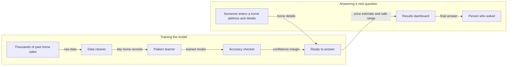

# KnownUnknowns

**Model-agnostic uncertainty-aware house price prediction system**

KnownUnknowns wraps a trained regression model with conformal prediction so the API can return both a point estimate and a statistically calibrated uncertainty interval.

---

## The Problem: A Number Without a Margin is a Guess

A model that predicts "$240,000" for a house gives you an answer, but not the whole answer. Two houses can receive similar estimates while having very different levels of uncertainty: one may look like thousands of homes in the training data, while another may combine unusual size, age, condition, and room counts.

Standard accuracy metrics measure average performance across a test set. They do not explain how much to trust any individual prediction. For real estate and other decision-heavy systems, the uncertainty around a prediction matters as much as the prediction itself.

---

## The Solution: Conformal Prediction

Conformal prediction wraps a trained model and produces a **coverage-calibrated interval** for regression. For this project, the default target coverage is 95%.

The guarantee is non-parametric and distribution-free under the usual conformal assumption that calibration and future examples are exchangeable.

### How It Works

1. **Train** a model on 60% of the data.
2. **Calibrate** on a separate 20% hold-out set:
   - Compute absolute residuals: `score = |true_price - predicted_price|`
   - Find the conformal quantile -> margin `q`
3. **Predict** on new inputs:
   - Point estimate: `prediction`
   - Interval: `[prediction - q, prediction + q]`

On held-out data, the interval is expected to contain the true sale price at approximately the configured confidence level.

---

## Current Dataset

The current implementation trains on the **Ames Housing** dataset from OpenML (`house_prices`). It predicts individual house sale prices in dollars.

### Input Features

| Feature | Description |
|---------|-------------|
| `GrLivArea` | Above-ground living area in square feet |
| `BedroomAbvGr` | Number of bedrooms above grade |
| `FullBath` | Number of full bathrooms |
| `OverallQual` | Overall material and finish quality, from 1 to 10 |
| `YearBuilt` | Original construction year |

---

## System Architecture



### How It Works

| Step | Plain English explanation |
|------|---------------------------|
| 1 | We start with thousands of real home sales, including what each house looked like and what it sold for. |
| 2 | We clean up the data so every home is described in the same consistent way before learning from it. |
| 3 | The model studies the patterns, learning things like how square footage and build year affect price. |
| 4 | We test the model on homes it has never seen before and measure how far off its guesses usually are. |
| 5 | That typical error becomes a built-in safety margin, so we can say how confident we are in any future guess. |
| 6 | When someone enters a new home, the model gives a price estimate plus a safe range, like saying roughly 185,000 give or take 45,000. |
| 7 | The dashboard shows both the number and the range side by side so the person can see not just the answer but how sure we are. |

---

## Architecture

```text
KnownUnknowns/
|-- ml/
|   |-- config.json       # task type, model type, confidence level, model params
|   |-- wrapper.py        # UncertaintyWrapper conformal layer
|   |-- train.py          # trains model, calibrates wrapper, saves wrapper.pkl
|   |-- conformal.py      # re-exports UncertaintyWrapper for compatibility
|   `-- wrapper.pkl       # generated trained + calibrated wrapper
|
|-- app/
|   |-- main.py           # FastAPI routes
|   |-- models.py         # prediction business logic
|   |-- schemas.py        # Pydantic request and response models
|   `-- utils.py          # wrapper loading and logging
|
|-- dashboard/
|   `-- streamlit_app.py  # UI for estimates and confidence intervals
|
|-- tests/
|   `-- test_api.py       # API integration tests
|
|-- requirements.txt
|-- Dockerfile
`-- README.md
```

---

## Quick Start

### 1. Install

```bash
pip install -r requirements.txt
```

### 2. Train and Calibrate

```bash
python -m ml.train
```

This downloads the Ames Housing dataset, trains the model configured in `ml/config.json`, calibrates the conformal margin, and saves `ml/wrapper.pkl`.

Sample output format:

```text
Train: 876 | Calibration: 292 | Test: 292
Conformal margin q = $45,000  (covers 95% of outcomes)
Test RMSE: $32,000 | Empirical coverage: 0.950 (target 0.95)
```

The exact values may differ depending on model configuration and dependency versions.

### 3. Start the API

```bash
uvicorn app.main:app --reload
```

API: `http://localhost:8000`

Interactive docs: `http://localhost:8000/docs`

### 4. Start the Dashboard

```bash
streamlit run dashboard/streamlit_app.py
```

Dashboard: `http://localhost:8501`

---

## Docker

```bash
docker build -t known-unknowns .
docker run -p 8000:8000 known-unknowns
```

The Docker image trains and calibrates the model during build so the API can serve predictions when the container starts.

---

## API Reference

### `GET /health`

Returns model loading and calibration metadata.

Example response:

```json
{
  "status": "ok",
  "model_loaded": true,
  "calibrated": true,
  "task_type": "regression",
  "features": ["GrLivArea", "BedroomAbvGr", "FullBath", "OverallQual", "YearBuilt"],
  "margin": 45000.0,
  "confidence_level": 0.95
}
```

### `POST /predict`

Returns the point prediction only.

Request:

```json
{
  "features": {
    "GrLivArea": 1500,
    "BedroomAbvGr": 3,
    "FullBath": 2,
    "OverallQual": 6,
    "YearBuilt": 1990
  }
}
```

Response:

```json
{
  "prediction": 184250.0,
  "prediction_usd": "$184,250"
}
```

### `POST /predict_with_uncertainty`

Returns the point prediction plus the conformal interval.

Request:

```json
{
  "features": {
    "GrLivArea": 1500,
    "BedroomAbvGr": 3,
    "FullBath": 2,
    "OverallQual": 6,
    "YearBuilt": 1990
  }
}
```

Response:

```json
{
  "prediction": 184250.0,
  "prediction_usd": "$184,250",
  "lower_bound": 139250.0,
  "upper_bound": 229250.0,
  "lower_bound_usd": "$139,250",
  "upper_bound_usd": "$229,250",
  "interval_width": 90000.0,
  "margin": 45000.0,
  "confidence_level": 0.95
}
```

The interval is calibrated from held-out data. A narrower interval means the model has lower calibrated error around similar examples; a wider interval means the point estimate should be treated with more caution.

---

## Model Configuration

Edit `ml/config.json` and re-run training:

```json
{
  "task_type": "regression",
  "model_type": "random_forest",
  "confidence_level": 0.95,
  "random_state": 42,
  "model_params": {
    "n_estimators": 300,
    "max_depth": 14,
    "min_samples_split": 4,
    "n_jobs": -1
  }
}
```

Available regression `model_type` values:

- `random_forest`
- `gradient_boosting`
- `linear_regression`
- `ridge`

---

## Bring Your Own Model

Any sklearn-style regression model can be wrapped as long as it implements `predict(X)`.

```python
import pickle
import numpy as np
from ml.wrapper import UncertaintyWrapper

with open("my_model.pkl", "rb") as f:
    model = pickle.load(f)

X_cal = np.load("my_calibration_X.npy")
y_cal = np.load("my_calibration_y.npy")

wrapper = UncertaintyWrapper(model, task_type="regression", alpha=0.05)
q = wrapper.calibrate(X_cal, y_cal)
print(f"Conformal margin: {q:.2f}")
wrapper.save()
```

For classification experiments, `UncertaintyWrapper` also contains prediction-set logic for models that implement `predict_proba(X)`. The shipped API, dashboard, training pipeline, and tests are currently focused on regression.

---

## Tests

The API tests expect a trained `ml/wrapper.pkl` to exist.

```bash
python -m ml.train
pytest tests/ -v
```

---

*For educational and research purposes only. Not financial or real estate advice.*
